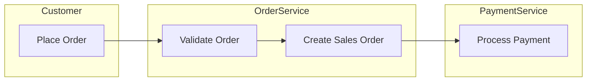
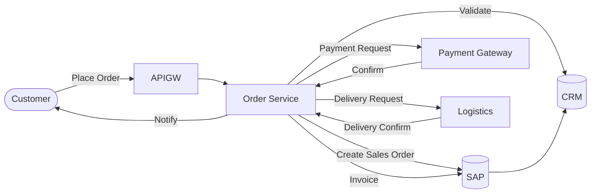
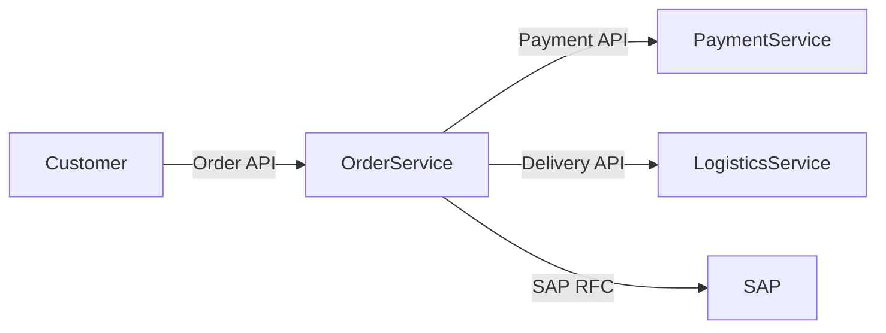
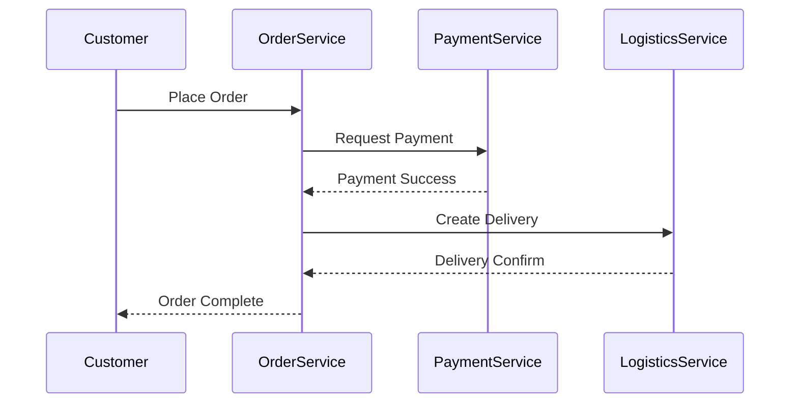
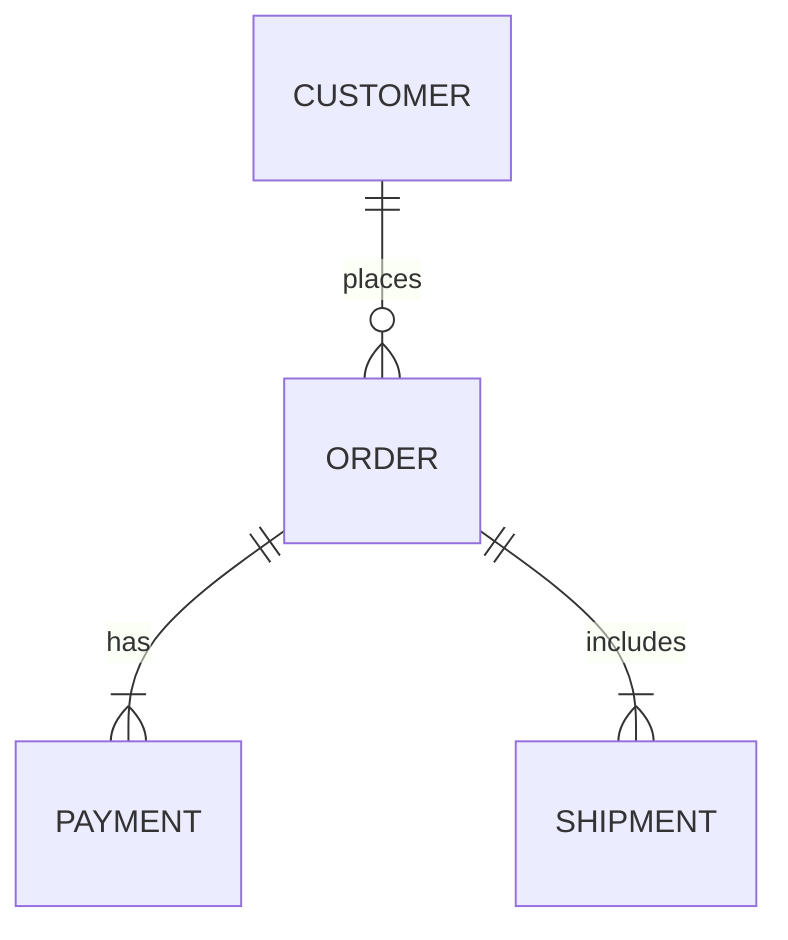

BPMN = มุมมอง "Process & Business Flow"
- แสดง swimlane → เห็นว่าใคร/ระบบไหนทำ activity ไหน
Swimlane: Customer / Order Service / Payment Service / Logistics
- Flow: Customer place order → Order Service create → Payment Service authorize → Logistics deliver
Mermaid = มุมมอง "System & Technical Flow"

Enterprise Architecture View ที่ควรมี
1. Business / Process View (BPMN)
- Mermaid ยังไม่รองรับ BPMN โดยตรง แต่ผมเขียน pseudo-flow แทนได้

2. Application / Integration View (Mermaid System Context)

3. Integration Flow / Sequence (Mermaid Sequence)

4. Data / Information View (Mermaid ERD)

