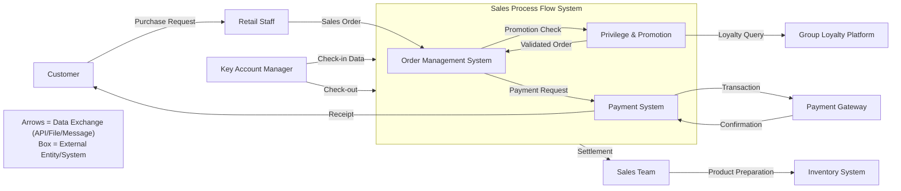

```mermaid
flowchart LR
    %% External Actors (Left) - Based on BPMN roles that interact with customers/external entities
    Customer[Customer]
    SalesTeam[Sales Team]
    KAManager[Key Account Manager]
    RetailStaff[Retail Staff]
    
    %% System Boundary (Center) - Sales Process Flow System with internal components
    subgraph SalesSystem["Sales Process Flow System"]
        OMS[Order Management System]
        PP[Privilege & Promotion]
        PM[Payment System]
    end
    
    %% External Systems (Right) - Systems that support the process
    InventorySystem[Inventory System]
    PaymentGateway[Payment Gateway]
    LoyaltyPlatform[Group Loyalty Platform]
    
    %% Data Flows - Based on BPMN sequence flows and activity descriptions
    SalesTeam -->|Product Preparation| InventorySystem
    KAManager -->|Check-in Data| SalesSystem
    Customer -->|Purchase Request| RetailStaff
    RetailStaff -->|Sales Order| OMS
    OMS -->|Promotion Check| PP
    PP -->|Loyalty Query| LoyaltyPlatform
    PP -->|Validated Order| OMS
    OMS -->|Payment Request| PM
    PM -->|Transaction| PaymentGateway
    PaymentGateway -->|Confirmation| PM
    PM -->|Receipt| Customer
    KAManager -->|Check-out| SalesSystem
    SalesSystem -->|Settlement| SalesTeam
    
    %% Legend
    Legend["`Arrows = Data Exchange (API/File/Message)
    Box = External Entity/System`"]
```
