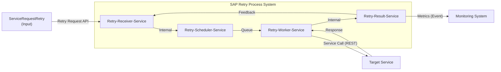

# SAP Retry Process - System Context Diagram

## Overview
This system context diagram shows the external entities and data flows for the SAP Retry Process System, which handles retry mechanisms for failed service requests in a distributed architecture.

## System Context Diagram

## Legend
- **Arrows**: Data Exchange (API, Queue, Event, Internal)
- **External Entity**: User / External System  
- **Service**: Internal Component

## External Entities

### ServiceRequestRetry (Input)
- **Description**: External input actor that initiates retry requests for failed service calls
- **Interaction**: Submits retry requests to the retry system via API

### Target Service
- **Description**: The original external service that failed and needs to be retried
- **Interaction**: Receives retry attempts from the Retry-Worker-Service

### Monitoring System
- **Description**: External observability platform for tracking retry metrics and system health
- **Interaction**: Receives metrics and status updates from the Retry-Result-Service

## Internal Services

### Retry-Receiver-Service
- **Description**: รับ Request ที่ต้องการ Retry (Receives requests that need retry)
- **Responsibility**: Receiver-Request
- **Function**: Entry point for retry requests, validates and forwards to scheduler

### Retry-Scheduler-Service  
- **Description**: Scheduler-Job, GetList-Retry-Request, update-retry-request, produce-retry-request
- **Responsibility**: produce-retry-request
- **Function**: Manages scheduling and queuing of retry operations

### Retry-Worker-Service
- **Description**: retry-request, produce-retry-request_and_response
- **Responsibility**: call retry, retry-request and response  
- **Function**: Executes actual retry operations to target services

### Retry-Result-Service
- **Description**: result-retry-request
- **Responsibility**: Result Processing
- **Function**: Processes retry results and provides feedback for cycle continuation

## Data Flows

| Source | Target | Protocol | Description |
|--------|--------|----------|-------------|
| ServiceRequestRetry (Input) | Retry-Receiver-Service | API | Initial retry request submission |
| Retry-Receiver-Service | Retry-Scheduler-Service | Internal | Validated retry request forwarding |
| Retry-Scheduler-Service | Retry-Worker-Service | Queue | Scheduled retry job |
| Retry-Worker-Service | Target Service | REST | Actual retry attempt to original service |
| Target Service | Retry-Worker-Service | REST Response | Service response (success/failure) |
| Retry-Worker-Service | Retry-Result-Service | Internal | Retry operation result |
| Retry-Result-Service | Retry-Receiver-Service | Feedback | Cycle continuation for re-processing |
| Retry-Result-Service | Monitoring System | Event | Retry metrics and status updates |

## System Boundary
The **SAP Retry Process System** contains four internal services that work together in a cyclic retry pattern:
1. **Retry-Receiver-Service**: Entry point for retry requests
2. **Retry-Scheduler-Service**: Manages timing and queuing 
3. **Retry-Worker-Service**: Executes retry operations
4. **Retry-Result-Service**: Processes results and manages feedback loops

The system implements a feedback loop from the result service back to the receiver service for continuous retry processing until success or maximum attempts are reached.