# Retry Process System Context Diagram

## System Overview
This diagram illustrates the system context for the Retry Process Flow, showing the main system boundary and external interactions.

## System Context Diagram

```mermaid
flowchart LR
    %% External Actors
    REQ["Service Request Initiator<br/>(ผู้ใช้งานระบบ)"]
    EXT["External Service<br/>(บริการภายนอก)"]
    
    %% System Boundary
    subgraph RETRY_SYSTEM["🔄 Retry Processing System"]
        REC["Retry Receiver Service"]
        SCH["Retry Scheduler<br/>Service"] 
        WRK["Retry Worker<br/>Service"]
        RES["Retry Result<br/>Service"]
    end
    
    %% Data Flows
    REQ -->|1.Retry Request| REC
    REC -->|2.Schedule Request| SCH
    SCH -->|3.Queue Retry| WRK
    WRK -->|4.Execute Retry| EXT
    EXT -->|5.Response| WRK
    WRK -->|6.Process Result| RES
    RES -->|7.Notify Result| REQ
    
    %% Feedback Loop
    WRK -->|Retry Loop| WRK
```

## Legend
- **External Entity**: External systems and actors that interact with the retry system
- **System Boundary**: The main retry processing system containing all internal services  
- **Internal Service**: Individual microservices within the retry system
- **Data Flow**: Numbered arrows indicate the sequential flow of data exchange and communication
- **Retry Loop**: Self-referencing arrow shows internal retry mechanism

## System Components

### External Actors
- **Service Request Initiator**: Systems or users that initiate retry requests
- **External Service**: Target services that receive and process retry requests

### Internal Services
- **Retry Receiver Service**: Entry point for incoming retry requests (รับ Request ที่่ต้องการ Retry)
- **Retry Scheduler Service**: Manages retry scheduling and queuing (Scheduler-Job, GetList-Retry-Request, update-retry-request, produce-retry-request)
- **Retry Worker Service**: Executes retry operations and handles responses (retry-request, produce-retry-request_and_response)
- **Retry Result Service**: Processes and delivers retry results (result-retry-request)

## Integration Patterns
- **Request-Response**: Synchronous communication for immediate feedback
- **Asynchronous Messaging**: Queue-based communication for reliable processing
- **Retry Loop**: Built-in retry mechanism with configurable parameters
- **Result Notification**: Callback mechanism for status updates

## Key Characteristics
- **Resilience**: Built-in retry mechanisms and error handling
- **Scalability**: Distributed service architecture supports horizontal scaling
- **Monitoring**: Each service can be monitored independently
- **Loose Coupling**: Services communicate through well-defined interfaces