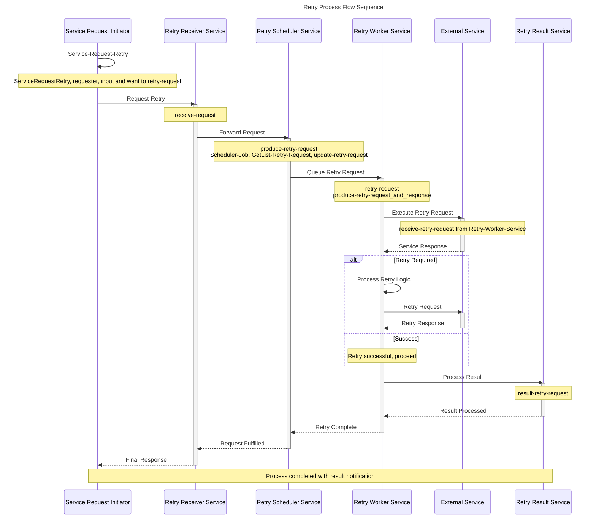

# Retry Process Sequence Diagram

## Sequence Flow Overview
This diagram shows the detailed interaction flow between all participants in the retry process, illustrating the chronological order of operations and message exchanges.

## Sequence Diagram

## Sequence Flow Description

### Phase 1: Request Initiation
1. **Service Request Initiator** generates a retry request
2. Request is sent to **Retry Receiver Service** for initial processing

### Phase 2: Request Processing
3. **Retry Receiver Service** validates and forwards the request
4. **Retry Scheduler Service** schedules the retry operation and manages the queue

### Phase 3: Retry Execution
5. **Retry Worker Service** picks up the scheduled request
6. Worker service executes the retry against the **External Service**
7. External service processes the request and returns a response

### Phase 4: Retry Logic (Conditional)
8. If retry is required, the worker service implements retry logic
9. Additional attempts are made until success or maximum retries reached

### Phase 5: Result Processing
10. **Retry Result Service** processes the final outcome
11. Results are propagated back through the chain
12. Final notification is sent to the original requester

## Timing and SLA Considerations
- Each service interaction should have defined timeout values
- Retry attempts should follow exponential backoff strategies
- Maximum retry attempts should be configurable
- Process monitoring should track end-to-end execution time

## Error Handling Scenarios
- **Network Failures**: Automatic retry with backoff
- **Service Unavailable**: Queue request for later processing
- **Invalid Requests**: Immediate rejection with error details
- **Timeout Scenarios**: Graceful degradation and notification

## Activity Mapping Table

| Activity ID | Sequence Step | Participant | Description |
|---|---|---|---|
| act0 | 1 | Service Request Initiator | Initial service request retry trigger |
| act1 | 2 | Service Request Initiator | Request-Retry submission |
| act2 | 3-4 | Retry Receiver Service | receive-request processing |
| act3 | 5-6 | Retry Scheduler Service | produce-retry-request scheduling |
| act4 | 7-11 | Retry Worker Service | retry-request execution and loop handling |
| act5 | 8-10 | External Service | receive-retry-request processing |
| act6 | 12-13 | Retry Result Service | result-retry-request final processing |
