# SAP Retry Process - Container Diagram

Generated from completed input_service_mapping.yaml using sa_004_phase_2

## Container Architecture Overview

This diagram shows the container-level architecture of the SAP Retry Process System, generated from the completed service mapping configuration using .NET technology stack and event-driven architecture patterns.

## Technology Stack (from Configuration)

**Selected Technologies:**
- **Backend Framework**: .NET
- **Frontend Framework**: Angular  
- **Database Primary**: MongoDB
- **Message Queue**: Apache Kafka
- **Cache**: Redis
- **API Gateway**: Kong
- **Monitoring**: Prometheus
- **Logging**: Loki
- **Deployment**: Kubernetes

## Mermaid C4 Container Diagram

```mermaid
graph TB
    %% External Systems and Users
    RequestingSystem["Requesting System<br/>(Service-Request-Retry)"]
    ExternalService["External Service<br/>(Third-party API)"]
    
    %% System Boundary
    subgraph RetrySystem["SAP Retry Process System"]
        direction TB
        
        %% Application Layer
        subgraph ProcessingLayer["Application Services"]
            RetryReceiver["Retry Receiver Service<br/>.NET API<br/>Port: 8081"]
            RetryScheduler["Retry Scheduler Service<br/>.NET API + Hangfire<br/>Port: 8082"]
            RetryWorker["Retry Worker Service<br/>.NET API<br/>Port: 8083"]
            RetryResult["Retry Result Service<br/>.NET API<br/>Port: 8084"]
        end
        
        %% Data Layer
        subgraph DataLayer["Data & Infrastructure"]
            MainDatabase[("Main Database<br/>MongoDB<br/>Collections: retry_requests, retry_schedules")]
            CacheLayer[("Cache Layer<br/>Redis<br/>Data: retry_config, rate_limits")]
            MessageQueue["Message Queue<br/>Apache Kafka<br/>Topics: retry_events, schedule_events"]
        end
        
        %% Monitoring Layer
        subgraph MonitoringLayer["Monitoring & Observability"]
            Monitoring["Monitoring Service<br/>Prometheus"]
            Logging["Centralized Logging<br/>Loki"]
        end
    end
    
    %% External Relationships (HTTP REST API pattern)
    RequestingSystem -->|"HTTP REST<br/>/api/v1/retry"| RetryReceiver
    RetryWorker -->|"HTTP<br/>External Service Calls"| ExternalService
    ExternalService -->|"Response<br/>Success/Failure"| RetryWorker
    
    %% Internal Service Communication (Kafka Event Streaming)
    RetryReceiver -->|"Kafka Events<br/>retry_events topic"| MessageQueue
    RetryScheduler -->|"Subscribe<br/>schedule_events"| MessageQueue
    RetryScheduler -->|"Produce<br/>worker tasks"| MessageQueue
    RetryWorker -->|"Subscribe<br/>process tasks"| MessageQueue
    RetryWorker -->|"Publish<br/>result_events"| MessageQueue
    RetryResult -->|"Subscribe<br/>result_events"| MessageQueue
    
    %% Database Access (MongoDB Operations)
    RetryReceiver -->|"INSERT<br/>retry_requests"| MainDatabase
    RetryScheduler -->|"SELECT/UPDATE<br/>retry_schedules"| MainDatabase
    RetryWorker -->|"UPDATE<br/>retry_attempts"| MainDatabase
    RetryResult -->|"INSERT<br/>retry_results"| MainDatabase
    
    %% Cache Usage (Redis Cache Operations)
    RetryScheduler -->|"GET/SET<br/>retry_config"| CacheLayer
    RetryWorker -->|"GET<br/>rate_limits"| CacheLayer
    RetryResult -->|"SET<br/>temp_results"| CacheLayer
    
    %% Monitoring & Logging
    RetryReceiver -.->|Metrics| Monitoring
    RetryScheduler -.->|Metrics| Monitoring
    RetryWorker -.->|Metrics| Monitoring
    RetryResult -.->|Metrics| Monitoring
    
    RetryReceiver -.->|Logs| Logging
    RetryScheduler -.->|Logs| Logging
    RetryWorker -.->|Logs| Logging
    RetryResult -.->|Logs| Logging
    
    %% Styling (High Contrast for Better Readability)
    classDef external fill:#f8d7da,stroke:#721c24,stroke-width:2px,color:#000
    classDef service fill:#d4edda,stroke:#155724,stroke-width:2px,color:#000
    classDef data fill:#d1ecf1,stroke:#0c5460,stroke-width:2px,color:#000
    classDef monitoring fill:#fff3cd,stroke:#856404,stroke-width:2px,color:#000
    
    class RequestingSystem,ExternalService external
    class RetryReceiver,RetryScheduler,RetryWorker,RetryResult service
    class MainDatabase,CacheLayer,MessageQueue data
    class Monitoring,Logging monitoring
```

## Service Mapping Table (Extracted from Configuration)

| Activity ID | Activity Name | Service Name | Technology | Port | Database Access | API Endpoints | Integration Pattern |
|-------------|---------------|--------------|------------|------|-----------------|---------------|-------------------|
| act2 | Retry-Receiver-Service | Retry Receiver Service | .NET API | 8081 | retry_requests | /api/v1/retry, /api/v1/status | HTTP REST API |
| act3 | Retry-Scheduler-Service | Retry Scheduler Service | .NET API + Hangfire | 8082 | retry_schedules, retry_config | /api/v1/schedule, /api/v1/config | Kafka Events |
| act4 | Retry-Worker-Service | Retry Worker Service | .NET API | 8083 | retry_attempts, retry_results | /api/v1/process, /api/v1/health | HTTP + Kafka |
| act6 | Retry-Result-Service | Retry Result Service | .NET API | 8084 | retry_results, audit_logs | /api/v1/results, /api/v1/reports | Kafka Events |

## Technology Stack Rationale (from Configuration)

### Service Technologies
All services use **.NET** as specified in `tech_stack.backend_framework`:
- **Retry Receiver Service**: .NET API for robust REST API handling and JSON processing
- **Retry Scheduler Service**: .NET API + Hangfire for advanced background job scheduling and processing
- **Retry Worker Service**: .NET API for high-performance async processing and external API calls
- **Retry Result Service**: .NET API for result aggregation and reporting capabilities

### Data & Infrastructure
Based on `tech_stack` selections:
- **MongoDB** (`database_primary`): NoSQL document database for flexible retry data storage
  - Collections: retry_requests, retry_schedules, retry_attempts, retry_results, retry_config, audit_logs
- **Apache Kafka** (`message_queue`): Event streaming platform for reliable async service communication
  - Topics: retry_events, schedule_events, result_events, audit_events  
- **Redis** (`cache`): In-memory data store for high-performance caching and rate limiting
  - Data types: retry_config, rate_limits, temp_results, session_data

### Infrastructure & DevOps
- **Kong** (`api_gateway`): API gateway for external API management and routing
- **Prometheus** (`monitoring`): Metrics collection and monitoring
- **Loki** (`logging`): Centralized logging and log aggregation
- **Kubernetes** (`deployment`): Container orchestration and deployment

## Integration Patterns (from Configuration)

1. **HTTP REST API**: Synchronous communication for external requests and health checks
   - Used for: External requests, service health checks
   - Example: POST /api/v1/retry for incoming retry requests

2. **Kafka Event Streaming**: Asynchronous event-driven communication between internal services
   - Used for: Inter-service communication, retry notifications
   - Topics: retry_events, schedule_events, result_events

3. **MongoDB Driver**: Direct database operations for data persistence
   - Used for: Data storage, audit logging
   - Operations: INSERT, SELECT, UPDATE on retry collections

4. **Redis Cache**: High-performance caching for configuration and rate limiting
   - Used for: Configuration management, rate limiting
   - Operations: GET/SET for retry configuration and limits

5. **External Service Calls**: Outbound HTTP calls for retry operations
   - Used for: Retry execution, external integration
   - Protocol: HTTP calls to target external services

## Container Responsibilities (Enhanced from Service Mapping)

### Retry Receiver Service
- **Technology**: .NET API (Port 8081)
- **Activities**: act2 (Retry-Receiver-Service)
- **Responsibility**: Receiver-Request
- **Description**: รับ Request ที่ต้องการ Retry
- **API Endpoints**: /api/v1/retry, /api/v1/status
- **Database Access**: retry_requests collection
- **Integration**: HTTP REST API for external requests, Kafka events for internal communication

### Retry Scheduler Service  
- **Technology**: .NET API + Hangfire (Port 8082)
- **Activities**: act3 (Retry-Scheduler-Service)
- **Responsibility**: produce-retry-request
- **Description**: Scheduler-Job, GetList-Retry-Request, update-retry-request, produce-retry-request
- **API Endpoints**: /api/v1/schedule, /api/v1/config
- **Database Access**: retry_schedules, retry_config collections
- **Integration**: Kafka events for job scheduling and worker task distribution

### Retry Worker Service
- **Technology**: .NET API (Port 8083)
- **Activities**: act4 (Retry-Worker-Service)
- **Responsibility**: call retry, retry-request and response
- **Description**: retry-request, produce-retry-request_and_response
- **API Endpoints**: /api/v1/process, /api/v1/health
- **Database Access**: retry_attempts, retry_results collections
- **Integration**: Kafka for task processing, HTTP for external service calls

### Retry Result Service
- **Technology**: .NET API (Port 8084)
- **Activities**: act6 (Retry-Result-Service)
- **Responsibility**: result processing and reporting
- **Description**: result-retry-request
- **API Endpoints**: /api/v1/results, /api/v1/reports
- **Database Access**: retry_results, audit_logs collections
- **Integration**: Kafka events for result aggregation and reporting

## Performance Requirements (from Configuration)

- **Target TPS**: 500 retry requests per second
- **Max Latency**: 2000ms maximum retry processing time
- **Availability**: 99.9% system availability
- **Retry Strategy**: Exponential backoff algorithm

## Deployment Configuration (from Configuration)

### Kubernetes Deployment
- **Environment**: Kubernetes container orchestration
- **Resource Limits**: 500m CPU, 512Mi memory per service
- **Replicas**:
  - Retry Receiver Service: 2 instances (load balancing for API requests)
  - Retry Scheduler Service: 1 instance (single coordinator for scheduling)
  - Retry Worker Service: 3 instances (parallel processing capacity)
  - Retry Result Service: 2 instances (redundancy for result processing)

## Benefits of Two-Phase Configuration-Driven Approach

### Phase 1 Benefits (Template Generation)
✅ **Auto-Discovery**: Services automatically identified from BPMN roles  
✅ **Complete Structure**: All necessary sections generated with placeholders  
✅ **Guided Selection**: Clear technology options for .NET ecosystem  
✅ **Port Management**: Sequential port assignment (8081-8084)  
✅ **API Suggestions**: RESTful endpoint patterns for .NET APIs  

### Phase 2 Benefits (Diagram Generation)
✅ **Configuration-Driven**: Uses completed input file for accurate representation  
✅ **Technology Consistency**: All services use .NET with appropriate frameworks  
✅ **Validation**: Checks for complete configuration before generation  
✅ **Traceability**: Clear mapping from activities to services to containers  
✅ **Documentation**: Complete service mapping table and technology rationale  

### .NET Ecosystem Integration
✅ **Hangfire Integration**: Scheduler service leverages Hangfire for background jobs  
✅ **Entity Framework**: MongoDB integration through .NET drivers  
✅ **Kafka Client**: .NET Kafka client for event streaming  
✅ **Health Checks**: Built-in .NET health check endpoints  
✅ **Monitoring**: Integration with Prometheus metrics for .NET applications  

## Integration with Other Rules

- **Input from sa_001**: BPMN XML and process flows
- **Phase 1 Enhancement**: Auto-generated service template from BPMN analysis
- **Phase 2 Output**: Accurate container diagram from .NET-focused configuration
- **Future Integration**: Service definitions ready for sa_005 (Data Model)

## Usage Summary

1. **Phase 1**: sa_004_phase_1 analyzed BPMN and generated service mapping template
2. **User Customization**: Technology stack selected (.NET, MongoDB, Kafka, Redis)
3. **Phase 2**: sa_004_phase_2 used completed configuration to generate this container diagram
4. **Result**: Comprehensive .NET-based microservices architecture for retry processing