# Sales Process System Context Diagram

## Overview
This system context diagram represents the Sales Process Flow as a collection of interconnected services and external actors, derived from the BPMN process model.

## Mermaid System Context Diagram

```mermaid
flowchart LR
    %% External Actors (Left side)
    Customer[("👤 Customer<br/>End user")]
    SalesRep[("👨‍💼 Sales Rep<br/>Field personnel")]
    
    %% API Gateway (Entry point)
    Gateway["🌐 API Gateway<br/>Central entry point"]
    
    %% Core Services Flow (Left to Right following process sequence)
    RouteService["📍 Route Planning<br/>(act1) จัด route<br/>Daily planning"]
    InventoryService["📦 Inventory Mgmt<br/>(act2) เบิกของขึ้นรถ<br/>Product loading"]
    CheckInService["📱 Check-in<br/>(act3) check-in<br/>Location validation"]
    RetailService["🏪 Retail Sales<br/>(act4) ขายของหน้าร้าน<br/>Store sales"]
    OrderService["📋 Order Mgmt<br/>(act5) รับคำสั่งซื้อ<br/>Order processing"]
    PromotionService["🎁 Promotion<br/>(act5-1) ตรวจสอบสิทธิ์<br/>Discount validation"]
    PaymentService["💳 Payment<br/>(act6) รับชำระเงิน<br/>Transaction processing"]
    CheckOutService["📤 Check-out<br/>(act7) check-out<br/>Departure processing"]
    ClearingService["💰 Cash Clearing<br/>(act8) เคลียร์เงิน<br/>End-of-day reconciliation"]
    
    %% External Systems (Top)
    CRM["🔗 CRM System"]
    ERP["🔗 ERP System"]
    PaymentGateway["🔗 Payment Gateway"]
    LoyaltyPlatform["🔗 Loyalty Platform"]
    LogisticsSystem["🔗 Logistics System"]
    
    %% Data Store (Bottom)
    Database[("💾 Sales Database<br/>Central data store")]
    
    %% Future Services (Bottom right)
    AfterSalesService["🔧 After Sales<br/>Returns & support"]
    LogisticsService["🚚 Logistics Exec<br/>Delivery coordination"]
    
    %% Customer Journey Flow (Entry)
    Customer -->|"Places order"| Gateway
    SalesRep -->|"Mobile app"| Gateway
    
    %% Main Process Flow (Left to Right)
    Gateway --> RouteService
    RouteService -.->|"Self-loop"| RouteService
    RouteService --> InventoryService
    InventoryService --> CheckInService
    CheckInService --> RetailService
    RetailService --> OrderService
    OrderService <-->|"Validation loop"| PromotionService
    OrderService --> PaymentService
    PaymentService --> CheckOutService
    CheckOutService --> ClearingService
    
    %% External System Integrations (Vertical connections)
    RouteService <-->|"RFC/SOAP"| CRM
    InventoryService <-->|"REST"| ERP
    OrderService <-->|"Event/MQ"| ERP
    PromotionService <-->|"REST"| LoyaltyPlatform
    PaymentService <-->|"HTTPS"| PaymentGateway
    ClearingService <-->|"Batch/FTP"| ERP
    
    %% Database connections (Bottom connections)
    RouteService -.->|"R/W"| Database
    InventoryService -.->|"R/W"| Database
    CheckInService -.->|"W"| Database
    RetailService -.->|"W"| Database
    OrderService -.->|"R/W"| Database
    PromotionService -.->|"R"| Database
    PaymentService -.->|"W"| Database
    CheckOutService -.->|"W"| Database
    ClearingService -.->|"R/W"| Database
    
    %% Future integrations
    Gateway -.->|"Future"| AfterSalesService
    Gateway -.->|"Future"| LogisticsService
    AfterSalesService <-.->|"REST"| LogisticsSystem
    LogisticsService <-.->|"REST"| LogisticsSystem
    
    %% Styling
    classDef customerClass fill:#e1f5fe,stroke:#01579b,stroke-width:2px
    classDef serviceClass fill:#f3e5f5,stroke:#4a148c,stroke-width:2px
    classDef externalClass fill:#fff3e0,stroke:#e65100,stroke-width:2px
    classDef gatewayClass fill:#e8f5e8,stroke:#1b5e20,stroke-width:3px
    classDef databaseClass fill:#fce4ec,stroke:#880e4f,stroke-width:2px
    classDef futureClass fill:#f5f5f5,stroke:#757575,stroke-width:1px,stroke-dasharray: 5 5
    
    class Customer,SalesRep customerClass
    class RouteService,InventoryService,CheckInService,RetailService,OrderService,PromotionService,PaymentService,CheckOutService,ClearingService serviceClass
    class CRM,ERP,PaymentGateway,LoyaltyPlatform,LogisticsSystem externalClass
    class Gateway gatewayClass
    class Database databaseClass
    class AfterSalesService,LogisticsService futureClass
```

## Service Mapping

| BPMN Activity | Service Name | Integration Protocol | External Dependencies |
|---------------|--------------|---------------------|----------------------|
| act1 | Route Planning Service | REST API | CRM System (RFC/SOAP) |
| act2 | Inventory Management Service | REST API | ERP System (REST API) |
| act3 | Check-in Service | REST API | - |
| act4 | Retail Sales Service | REST API | - |
| act5 | Order Management Service | REST API | ERP System (Event/MQ) |
| act5-1 | Promotion & Privilege Service | REST API | Loyalty Platform (REST API) |
| act6 | Payment Processing Service | REST API | Payment Gateway (HTTPS/REST) |
| act7 | Check-out Service | REST API | - |
| act8 | Cash Clearing Service | REST API | ERP System (Batch/FTP) |

## Architecture Notes

### Service Design Patterns
- **API Gateway Pattern**: Centralized entry point for all client requests
- **Microservices Architecture**: Each BPMN activity mapped to independent service
- **Event-Driven Architecture**: Asynchronous communication for order processing
- **Validation Loop**: Promotion service creates feedback loop with order service

### Integration Protocols
- **REST API**: Primary protocol for internal service communication
- **RFC/SOAP**: Legacy integration with CRM system
- **Event/MQ**: Asynchronous messaging for order events
- **HTTPS/REST**: Secure payment processing
- **Batch/FTP**: End-of-day batch processing for clearing

### Critical Path
The critical path flows through: `act2 → act3 → act4 → act5 → act5-1 → act5 → act6 → act7 → act8`

### Future Enhancements
- After Sales Service integration for returns and support
- Logistics Execution Service for delivery coordination
- Real-time analytics and monitoring services

---
*Generated from: architect/salesProcessFlow.bpmn*  
*Documentation: architect/salesProcessFlow.md*  
*Generated on: $(date)*
