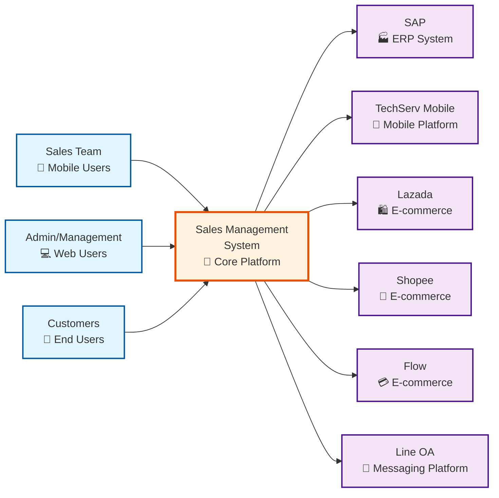
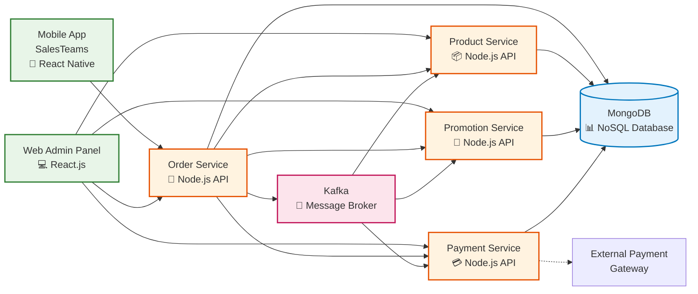
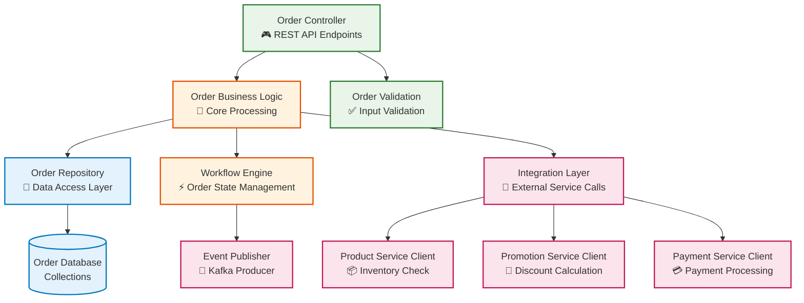
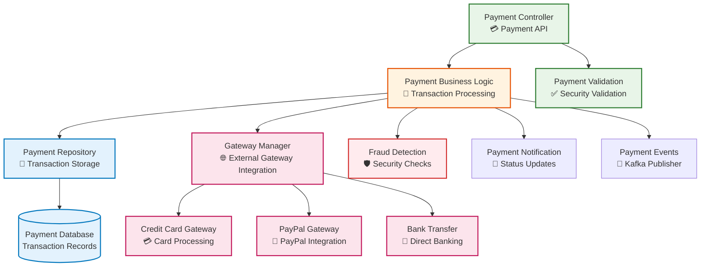
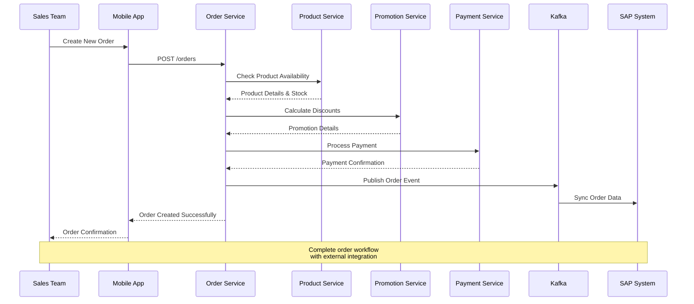
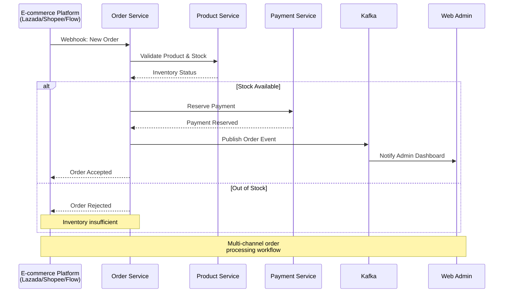
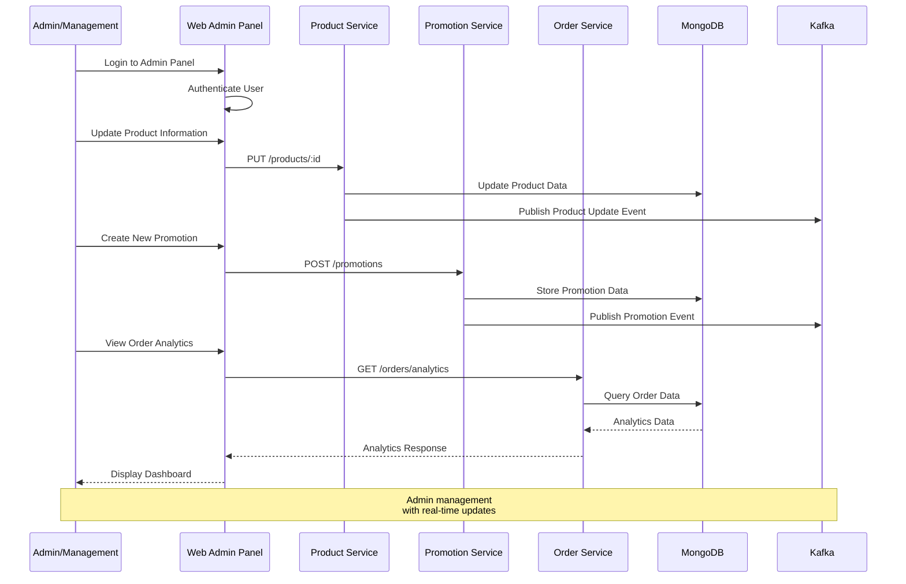

# C4 Model Documentation - Sales Management System
**Project:** Microservice-based Sales Management System with Multi-channel Support

---

# 1️⃣ เริ่มจาก Context Diagram

เป็นภาพรวมสูงสุดของระบบ (System in Context)

แสดงว่า ระบบของเราคุยกับใครบ้าง (External Systems / Users / Clients)

## System Context Overview

ระบบ Sales Management Platform เป็นศูนย์กลางที่เชื่อมต่อกับผู้ใช้งาน 3 กลุ่มหลักและระบบภายนอก 6 ระบบ

### Context Relationships Description:

#### 👥 **Primary Users:**
- **Sales Team:** ใช้ Mobile App สำหรับจัดการลูกค้าและสั่งซื้อ
- **Admin/Management:** ใช้ Web Panel สำหรับจัดการระบบและรายงาน
- **Customers:** สั่งซื้อผ่าน Online Platforms ต่างๆ

#### 🔗 **External System Integrations:**
- **SAP:** ซิงค์ข้อมูลคำสั่งซื้อและสินค้า
- **TechServ Mobile:** Platform สำหรับ Mobile App
- **E-commerce Platforms:** รับคำสั่งซื้อจาก Lazada, Shopee, Flow
- **Line OA:** สื่อสารกับลูกค้าและรับออเดอร์

---

# 2️⃣ ต่อด้วย Container Diagram

แสดงว่า ระบบถูกแบ่งออกเป็นอะไรบ้าง (Web App, Mobile App, Database, API Service ฯลฯ)

## Internal Container Architecture

ภายในระบบประกอบด้วย 8 Container หลัก ที่ทำงานร่วมกันในรูปแบบ Microservice Architecture

### Container Responsibilities:

#### 🖥️ **User Interface Layer:**
- **Mobile App (SalesTeams):** Sales team interface สำหรับการจัดการลูกค้าและออเดอร์
- **Web Admin Panel:** Management interface สำหรับการจัดการระบบและข้อมูล

#### ⚙️ **Microservice Layer:**
- **Order Service:** จัดการคำสั่งซื้อและ workflow หลัก
- **Product Service:** จัดการข้อมูลสินค้าและ inventory
- **Promotion Service:** จัดการโปรโมชั่นและส่วนลด
- **Payment Service:** ประมวลผลการชำระเงิน

#### 💾 **Data & Messaging Layer:**
- **MongoDB:** Primary database สำหรับเก็บข้อมูลทั้งหมด
- **Kafka:** Message broker สำหรับ event-driven communication

---

# 3️⃣ แล้วค่อยไปที่ Component Diagram

แบ่ง Container เป็น Component ย่อย

แสดง logic ภายใน, service, module, microservice

## Order Service Components

รายละเอียดภายใน Order Service ซึ่งเป็น core service ของระบบ

## Payment Service Components

รายละเอียดภายใน Payment Service สำหรับการประมวลผลการชำระเงิน

---

# 4️⃣ Optional: Sequence Diagram / Flow

แสดง flow ของข้อมูลหรือ request-response ระหว่าง component / user / external system

## Sales Team Order Processing Flow

แสดงขั้นตอนการสั่งซื้อผ่าน Mobile App ของ Sales Team

## Multi-Channel Order Integration Flow

แสดงการรับคำสั่งซื้อจาก E-commerce Platforms ต่างๆ

## Admin Management Flow

แสดงการจัดการระบบผ่าน Web Admin Panel

---

# 📊 Architecture Summary

## System Characteristics:
- **Architecture Pattern:** Microservices
- **Database:** MongoDB (NoSQL)
- **Message Broker:** Apache Kafka
- **API Style:** RESTful APIs
- **Frontend:** React.js (Web) + React Native (Mobile)

## Key Design Decisions:
1. **Event-Driven Architecture** ใช้ Kafka สำหรับ loose coupling
2. **Domain-Driven Design** แบ่ง service ตาม business domain
3. **Multi-Channel Support** รองรับหลายช่องทางการขาย
4. **Scalable Infrastructure** รองรับการขยายตัวในอนาคต

## Integration Points:
- **SAP Integration:** Real-time order synchronization
- **E-commerce APIs:** Webhook-based order integration
- **Payment Gateways:** Multiple payment method support
- **Mobile Platform:** TechServ Mobile SDK integration

---

**Location:** `/c4model/c4-model-documentation.md`
**Last Updated:** 2024
**Version:** 1.0
