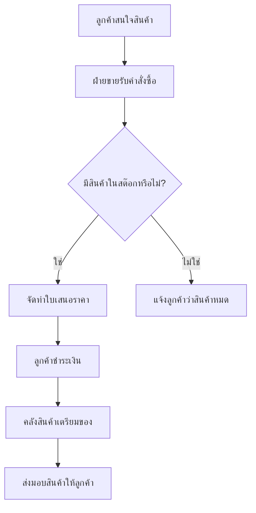

```mermaid
flowchart TD
    A[ลูกค้าสนใจสินค้า] --> B[ฝ่ายขายรับคำสั่งซื้อ]
    B --> C{มีสินค้าในสต๊อกหรือไม่?}
    C -->|ใช่| D[จัดทำใบเสนอราคา]
    D --> E[ลูกค้าชำระเงิน]
    E --> F[คลังสินค้าเตรียมของ]
    F --> G[ส่งมอบสินค้าให้ลูกค้า]
    C -->|ไม่ใช่| H[แจ้งลูกค้าว่าสินค้าหมด]
```
