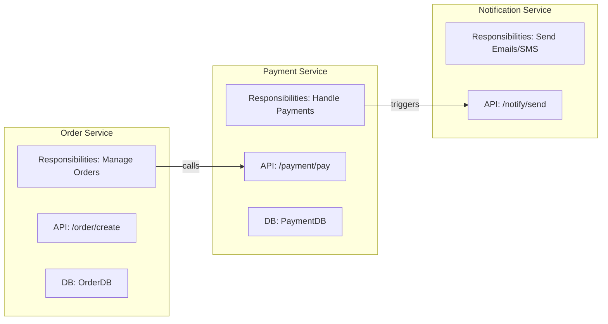

```mermaid
flowchart LR
    subgraph ServiceA["Order Service"]
        A1[Responsibilities: Manage Orders]
        A2[API: /order/create]
        A3[DB: OrderDB]
    end

    subgraph ServiceB["Payment Service"]
        B1[Responsibilities: Handle Payments]
        B2[API: /payment/pay]
        B3[DB: PaymentDB]
    end

    subgraph ServiceC["Notification Service"]
        C1[Responsibilities: Send Emails/SMS]
        C2[API: /notify/send]
    end

    %% Dependencies
    A1 -->|calls| B2
    B1 -->|triggers| C2

```